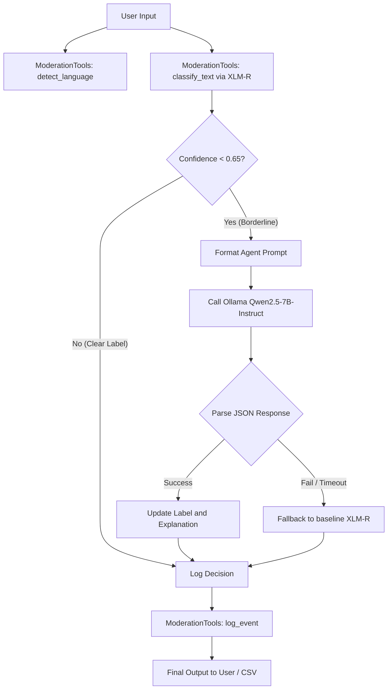

# Agentic AI Architecture

## 1. Overview and Rationale
To handle linguistically complex comments (such as sarcasm, double-entendre, and slang), the ViHSD system implements a hybrid **Router-Agent Architecture**.
- **First Pass (XLM-R Classifier)**: Quick, low-cost prediction.
- **Agentic Routing (Ollama Qwen2.5)**: Triggered only for "grey area" or borderline comments where the classifier's confidence score falls below **65%** (e.g. `confidence < 0.65`).

---

## 2. Multi-Step Reasoning Flow
When a borderline comment is routed to the agent, the `ContentModerator` class triggers a multi-step reasoning process:



---

## 3. Tool Configurations
The agent interacts with the environment and system state through three tools defined in `src/agent/moderator.py`:

### Tool 1: `classify_text(text: str)`
- **Purpose**: Get raw classification labels and soft probabilities from the fine-tuned XLM-R Base model.
- **Output Schema**:
  ```json
  {
    "label": "CLEAN" | "OFFENSIVE" | "HATE",
    "confidence": 0.5213,
    "probabilities": {
      "CLEAN": 0.4787,
      "OFFENSIVE": 0.5213,
      "HATE": 0.0000
    },
    "is_borderline": true
  }
  ```

### Tool 2: `detect_language(text: str)`
- **Purpose**: Detect the primary language of the comment to filter out non-Vietnamese spam or adjust context.
- **Output Schema**:
  ```json
  {
    "language": "vi"
  }
  ```

### Tool 3: `log_event(text, label, action, reason, ...)`
- **Purpose**: Write the moderation metadata to an audit log (`scratch/system_audit_log.jsonl`) for compliance and drift monitoring.
- **Privacy constraint**: To prevent PII leaks, only the SHA-256 hash prefix (first 16 chars) of the text is saved, rather than the raw comment.

---

## 4. System Prompts
The LLM is configured with strict instructions to enforce structured JSON outputs and guide reasoning:

### Single Inference System Prompt:
```
Bạn là chuyên gia kiểm duyệt nội dung của hệ thống ViHSD. Hãy phân tích sắc thái ngữ nghĩa (mỉa mai, châm biếm, từ lóng, ngữ cảnh) của văn bản đầu vào và kết quả phân loại từ mô hình cơ sở. Hãy đưa ra quyết định cuối cùng. Chỉ trả về chuỗi JSON duy nhất theo định dạng bắt buộc, không kèm lời dẫn:
{"final_label": "CLEAN"|"OFFENSIVE"|"HATE", "explanation": "Lý do ngắn gọn bằng tiếng Việt"}
```

---

## 5. Example Interaction Log
Below is an example of an input comment routing through the agent:

* **Input Text**: `"Cũng khôn lắm nhưng khôn lồn :)"`
* **Baseline Classifier Prediction**: 
  - `label`: `OFFENSIVE`, `confidence`: `0.54` (rushed classification).
  - Since `confidence (0.54) < 0.65`, routing is triggered.
* **Agent System Call (Ollama)**:
  - System prompt: Evaluates baseline outputs.
  - LLM Reasoning Output:
  ```json
  {
    "final_label": "HATE",
    "explanation": "Câu nói sử dụng từ ngữ thô tục để chửi bới, hạ nhục đối phương trực tiếp, thuộc mức độ thù ghét."
  }
  ```
* **Tool: `log_event`**:
  ```json
  {
    "timestamp": "2026-06-11T18:40:00Z",
    "text_hash": "a4d3e589cf8b21ad",
    "language": "vi",
    "label": "HATE",
    "confidence": 0.54,
    "action": "BLOCK",
    "reason": "Câu nói sử dụng từ ngữ thô tục để chửi bới, hạ nhục đối phương trực tiếp, thuộc mức độ thù ghét.",
    "agent_processed": "YES"
  }
  ```
